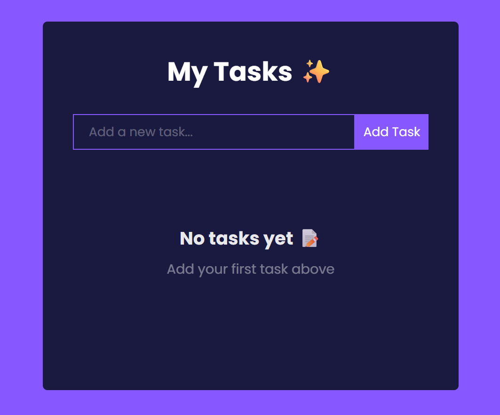
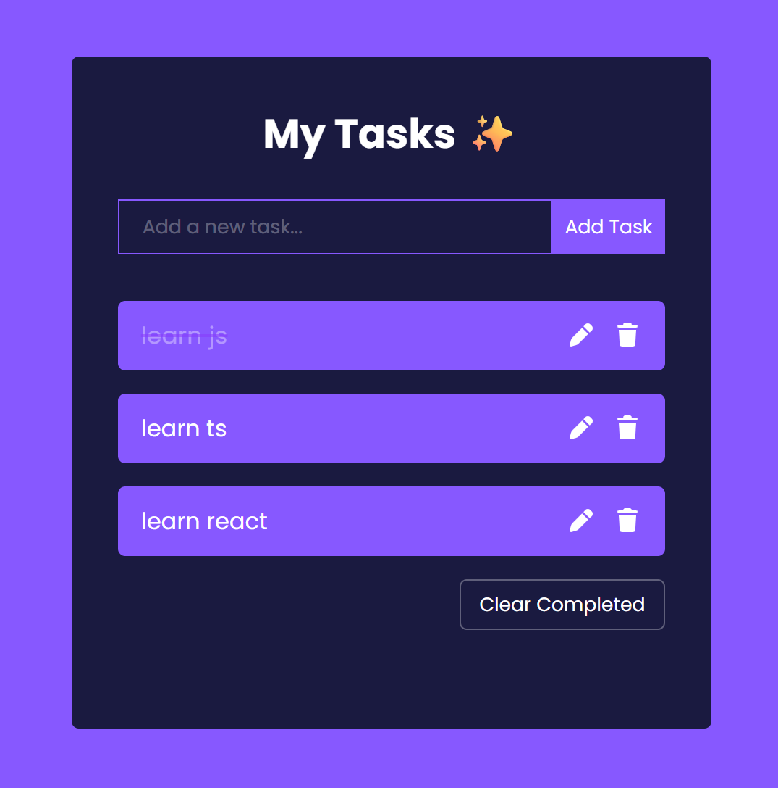

# 📝 Todo App (React + TypeScript)

A modern, responsive Todo application built with **React, TypeScript, and localStorage**.  
This project focuses on clean architecture, smooth UX, and real-world React patterns.

---

## 🚀 Live Demo

✅ Vercel Deployment:  
👉 Live Preview: **[https://react-type-script-todo-app.vercel.app]**

---

## ✨ Features

- ➕ Add new tasks with validation
- 📝 Edit tasks using SweetAlert2 modal
- 🗑️ Delete tasks with confirmation dialog
- ✔️ Toggle task completion (done / not done)
- 💾 Persistent storage with **localStorage**
- 🚫 Prevent duplicate tasks (case-insensitive)
- 🔍 Input validation with toast notifications
- 🧹 Clear completed tasks with confirmation
- 📭 Empty state UI when no tasks exist
- 🎯 Auto-focus input on load & after adding task
- 📱 Fully responsive design (mobile + desktop)
- 🎨 Smooth hover effects and transitions
- ⚡ Fast and lightweight UI

---

## 🛠️ Tech Stack

- React (Functional Components)
- TypeScript
- CSS (Custom styling)
- SweetAlert2 (Dialogs & confirmations)
- React Hot Toast (Notifications)
- localStorage API

---

## 📸 UI Preview

---

## ⚡ UX Highlights

- Smooth animations
- SweetAlert2 confirmations
- Toast notifications
- Auto-focus input behavior
- Duplicate prevention
- Empty state UI

---

## 🌐 Deployment (Vercel)

This project is deployed on Vercel and automatically updates when changes are pushed to the main branch.

---

## 👨‍💻 Author

Made with ❤️ while learning TypeScript

- GitHub: [MuhammadRoshani](https://github.com/MuhammadRoshani)

---

## 📄 License

This project is open source and free to use.
